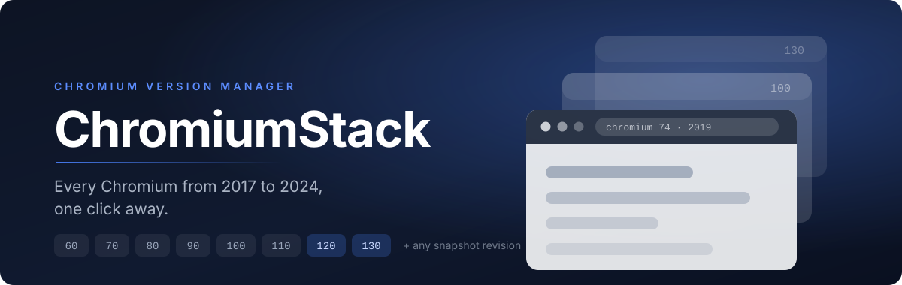
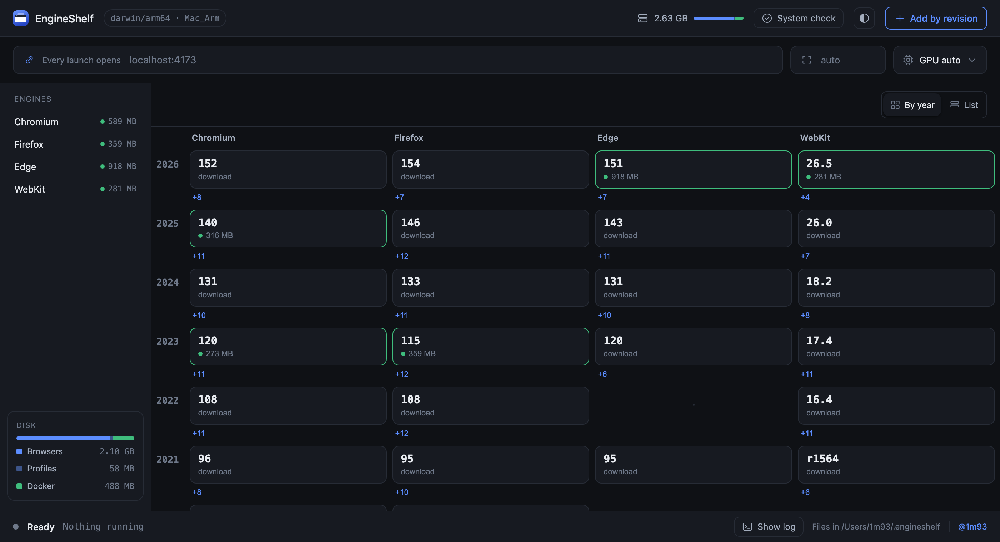

<p align="center">
  
</p>

<p align="center">
  <a href="https://github.com/1m93/Chromium-Stack/releases/latest"></a>
  
  
  
  <a href="https://github.com/1m93/Chromium-Stack/releases"></a>
</p>

<p align="center">
  <b>A shelf of real browsers, going back to 2017.</b><br>
  Pick a Chromium version, press Launch, and it opens as an ordinary desktop browser —<br>
  tabs, bookmarks, DevTools and all. No account, no build step, nothing to configure.
</p>

<p align="center">
  <a href="#download"><b>Download</b></a> ·
  <a href="#sixty-seconds-to-your-first-old-browser">Quick start</a> ·
  <a href="#the-version-shelf">Versions</a> ·
  <a href="#inside-the-manager">The manager</a> ·
  <a href="#good-to-know">Good to know</a>
</p>

---

## Why people keep one of these around

Modern browsers are excellent liars. They quietly polyfill, gracefully degrade and make
your site look finished — right up until it meets an engine from 2019, where an
unsupported CSS declaration is **dropped, not degraded**, and a layout falls apart in a
way nothing on your machine will ever show you.

|  | The situation | What ChromiumStack gives you |
|---|---|---|
| **Kiosks & devices** | POS terminals, scanners and industrial tablets ship a System WebView years behind the OS. It is the *engine* that decides whether your CSS survives. | The same engine on your desk, in a window you can click around in. |
| **The support ticket** | A customer on a locked-down browser reports a bug you cannot reproduce anywhere. | Open their engine, load the page, see it happen. |
| **The `browserslist` claim** | Your config promises support for an old floor. Nobody has ever checked. | Two minutes to find out whether the promise is true. |
| **The regression hunt** | Something broke *somewhere* between two releases. | 90, 105 and 120 open side by side, bisected by eye. |

---

## Download

Grab the build for your platform from the [**Releases** page][releases]. Every download is
**self-contained** — the launcher finds everything it needs inside the package. Nothing to
install, nothing to keep together, no loose folder of files to lose.

| Platform | File | How you open it |
|---|---|---|
| **macOS** | `ChromiumStack-<ver>-macOS.zip` | Unzip → double-click **`ChromiumStack.app`** (drag it to Applications if you like) |
| **Windows** | `ChromiumStack-<ver>-Windows.zip` | Unzip → double-click **`ChromiumStack.bat`** (want a Desktop icon? run `Create-Shortcut.ps1` once) |
| **Linux** | `ChromiumStack-<ver>-Linux.tar.gz` | Extract → run **`./ChromiumStack`** |

<sub>**Runs on** — macOS 10.13+ on Intel and 11+ on Apple Silicon · Windows 10/11, using the PowerShell 5.1 that ships with them · Linux x86_64. The manager wants Python 3 on macOS and Linux; the command line does not.</sub>

<sub>Paranoid, sensibly so? `shasum -c SHA256SUMS.txt` verifies the download against the published checksums. Prefer to build the packages yourself — see [RELEASE.md](RELEASE.md).</sub>

<sub>**Windows warns about the download?** `ChromiumStack.bat` is a short, readable script — you can open it in Notepad — that just starts the manager (`app\gui.ps1`); there is no compiled program to trust. If SmartScreen or a “Run anyway?” prompt appears, that is expected for any downloaded script without a paid certificate, not a sign of anything wrong. If it feels stuck, unblock the folder first: in PowerShell, `Get-ChildItem -Recurse | Unblock-File` (clears the “downloaded from the internet” mark), or right-click each file → Properties → **Unblock**. Verify against `SHA256SUMS.txt` if you want certainty. Want a Desktop/Start-Menu icon instead of the plain `.bat`? Run `Create-Shortcut.ps1` once after extracting.</sub>

<sub>**Running from a clone instead?** Same launchers, plus `./gui.sh` (or the `chromium-stack.desktop` entry) on Linux. Keep the launcher inside the project folder — it finds everything else relative to itself.</sub>

[releases]: https://github.com/1m93/Chromium-Stack/releases/latest

---

## Sixty seconds to your first old browser

<table>
<tr>
<td width="33%" valign="top">

### 1 · Open it

Double-click the launcher. The **manager** opens in your normal browser: every version,
what is installed, what each one costs in disk.

</td>
<td width="33%" valign="top">

### 2 · Pick a version

Press **Launch** on any row. The first launch of a version downloads it — 90–300 MB, a few
minutes, once. Every launch after that is instant.

</td>
<td width="33%" valign="top">

### 3 · Use it

A real browser window opens. Type a URL, open DevTools, log in, keep the profile. Close the
launcher window when you are done.

</td>
</tr>
</table>

<p align="center">
  
  <br>
  <sub>Every catalogued milestone on one page — which are installed, which run natively, which go
  through Rosetta, what each is costing you in disk, and one button to open any of them.</sub>
</p>

> [!TIP]
> Type a URL in the box at the top of the manager and **every** version you launch opens
> straight to it. `localhost:4173` is fine — it is the fastest way to compare four engines
> on the same page.

Prefer the terminal? The whole thing is one command:

```bash
./chromium-stack.sh run 74        # install if needed, then launch Chromium 74
```

---

## Inside the manager

One page, served locally, with everything on it.

| | |
|---|---|
| **One-click install & launch** | Missing builds download on demand, then open. No separate install step to remember. |
| **A shared URL for every launch** | Set it once at the top; every version opens there. |
| **Window size and graphics** | Fix the viewport for a layout check, or force hardware acceleration on or off. |
| **Per-row menu** | Download without launching, run that version in Docker, reset its profile, or delete it. |
| **Add by revision** | Any build in the Chromium snapshot archive, not just the catalogued milestones. |
| **System check** | Tells you what is missing before it matters, with buttons that install it. |
| **A live log panel** | Downloads, dependency installs and Docker containers stream their output line by line — the same text a terminal would show. |
| **Honest disk accounting** | A running total across every browser and profile, so it is obvious when to clear something out. |

Closing the launcher window stops the manager; browsers it opened keep running.

> [!NOTE]
> **Nothing listens outside your machine.** The server binds to `127.0.0.1` and every
> request must carry a token generated for that run, so a web page you happen to have open
> cannot drive your browser installs. On macOS and Linux the manager needs **Python 3**
> (macOS: it arrives with `xcode-select --install`); Windows needs nothing extra; the
> command line needs neither.

---

## The version shelf

Every catalogued milestone is verified against the live archive — and any other snapshot
revision works too. The shelf is not frozen at whatever shipped in your copy:
a milestone this build has never heard of is looked up in the archive the first time you
ask for it, and remembered afterwards, so a newly released Chromium runs without updating
ChromiumStack. See [Keeping up with Chrome](#keeping-up-with-chrome).

| Era | Versions | What changes here |
|---|---|---|
| **2017–2018** | `60` `65` `70` | Hard floors for very old WebViews. |
| **2019–2020** | `74` `76` `80` | No flexbox `gap`; optional chaining arrives in 80. |
| **2020–2021** | `85` `90` | Flexbox `gap`, `aspect-ratio`, `:is()`. |
| **2021–2022** | `95` `100` `105` | Container queries and `:has()` arrive in 105. |
| **2023** | `110` `115` `120` | `dvh`, CSS nesting, view transitions, `subgrid`. |
| **2024** | `125` `130` | Near-current — the control when you are bisecting. |

Those are the hand-picked ones, each chosen because something interesting lands there.
Newer milestones are added on the same spacing as Chrome releases them — run
`./chromium-stack.sh catalog` for what your machine can actually launch today.

<details>
<summary><b>Running a version that is not on the shelf</b></summary>

<br>

Use **Add by revision** in the manager, or pass the revision straight to the CLI. To find
the branch base position for a milestone:

```bash
curl -s "https://chromiumdash.appspot.com/fetch_milestones?mstone=74" \
  | python3 -c "import sys,json; print(json.load(sys.stdin)[0]['chromium_main_branch_position'])"
# 638880
```

Then `./chromium-stack.sh run 638880`. Not every commit position is archived; if that exact
one was never built for your platform, the tool says so — try one a few commits later.

**Older than 60 is not a limit we chose.** The snapshot bucket does hold builds going back
to 2011, and you are welcome to pass one of those revisions — but three separate walls sit
just below M60, and none of them can be worked around from here:

- macOS builds from that era are **32-bit i386**. macOS dropped 32-bit support in Catalina
  and Rosetta 2 only translates x86_64, so they cannot start at all — `bad CPU type in
  executable`, not a bug you can fix.
- The `Win_x64` bucket has nothing before roughly r389148 (~M52). Only 32-bit `Win` goes
  further back.
- chromiumdash has no branch position below **M59**, so a milestone number cannot be
  resolved to a revision automatically — you would have to know the revision yourself.

Linux is the one platform where the old builds are still 64-bit, and even there Chromium
below ~M64 wants `libgconf-2.so.4`, which modern distributions no longer ship.

`catalog.tsv` pins one *verified* build per milestone per platform, because the nearest
archived build is sometimes tens of commits away from the branch point. Regenerate it
against the live archive any time:

```bash
python3 tools/refresh-catalog.py           # rewrite catalog.tsv
python3 tools/refresh-catalog.py --check   # verify without writing
```

The historical milestones are hand-picked and live in `ANCHORS`; past the end of that list
the script extends itself on the same five-milestone spacing up to whatever Chrome has
stable, so a new release does not need the file edited. Add an out-of-band milestone by
putting it in `ANCHORS` and rerunning.

</details>

---

## Keeping up with Chrome

Chrome branches a new milestone roughly every four weeks. Nothing here needs a new release
of ChromiumStack for that to show up.

**On the command line.** Ask for any milestone. If it is not in `catalog.tsv`, the archive
is asked instead — the branch point from chromiumdash, then the nearest revision the
snapshot bucket actually built — and the answer is written to
`~/.chromium-stack/catalog.cache.tsv`. That file is read *before* the shipped catalog, so
the newest answer always wins:

```bash
./chromium-stack.sh run 152        # never heard of it? looked up once, then cached
./chromium-stack.sh catalog        # also picks up anything released since your build
```

A resolved milestone never expires: a branch point does not move, and the snapshot bucket
only ever grows. The cache carries no TTL, and only "which milestone is stable right now"
is re-checked, once a day. Offline, the last answer stands — the cache and the shipped
catalog are both still there, and every milestone you have used before still launches.
The one thing that can go stale is a revision the bucket later drops; if a download 404s,
that row is forgotten and the next run re-resolves it.

The cache lives under your home rather than beside `catalog.tsv` on purpose: the shipped
catalog is often on a read-only volume — inside `ChromiumStack.app`, for one.

**In the manager.** Same cache, same precedence. It asks the CLI to refresh in the
background at startup, so the list fills in without blocking the page.

**On the landing page.** It renders the milestones it shipped with, then asks the same
public sources and remembers the result in `localStorage`. A fetch that fails, is blocked,
or is simply offline changes nothing on screen.

**In the repository.** A weekly workflow reruns `tools/refresh-catalog.py` and
`tools/sync-landing.py` and commits the result. That is an optimisation, not the mechanism:
it keeps the copy everyone downloads current, so a fresh install starts from a recent
catalogue instead of resolving its way there.

Nothing in the prose — here, on the site, or in the page metadata — names a count or a
version range. Those are the sentences that quietly go wrong four weeks later, and there
is no number worth writing down that the tool cannot show you itself.

---

## It really is a browser

Address bar, tabs, bookmarks, history, downloads, DevTools — all there, and each version
keeps its own profile between launches. Visit anything you like.

Do bear in mind that the old ones really are old. Sites built for a modern engine may refuse
to load, render strangely, or nag you to upgrade. That is the browser being honest, not the
tool misbehaving.

**Every version gets its own profile**, and not for tidiness: Chromium writes a version
number into a profile and **refuses to open one written by a newer build**. A shared
profile would break the moment you went back a version. So logging into a test environment
in 74 leaves 120 untouched, and neither goes near your everyday browser.

> [!IMPORTANT]
> **Point it at a production build, not your dev server.** Vite, Next.js and friends ship
> your source untranspiled and skip the CSS-fallback step, so an old engine chokes on the
> dev server even when your shipped build is perfectly fine. A blank page on
> `localhost:3000` usually means *"the dev server is modern"*, not *"my code is broken"*.
> Build the site the way you deploy it, serve the output, and open **that**.

---

## For terminal people

The manager is a front end for the CLI — both do the same things, so they cannot drift apart.

```bash
./chromium-stack.sh catalog                    # versions available for this machine
./chromium-stack.sh list                       # what is installed, with disk usage
./chromium-stack.sh run 74                     # install if needed, then launch
./chromium-stack.sh run 120 localhost:4173     # launch 120 on a URL
./chromium-stack.sh run 638880                 # launch a raw snapshot revision
./chromium-stack.sh install 90                 # download without launching
./chromium-stack.sh remove 90                  # delete a downloaded browser
./chromium-stack.sh clean 90                   # reset that version's profile
./chromium-stack.sh doctor                     # check dependencies
./chromium-stack.sh gui                        # open the manager
```

Flags for `run`: `--size 1280x800`, `--gpu` / `--no-gpu`, `--no-restart`, and anything after
`--` goes straight to Chromium. `<version>` is a milestone (`74`) or a snapshot revision
(`638880`) — milestones are small and revisions are six digits or more, so there is nothing
to disambiguate. Windows runs the same commands through `.\chromium-stack.ps1`.

---

## Docker edition

Runs the **Linux x86_64** build in a container and shows its desktop in a tab of your normal
browser, over noVNC. It never touches Rosetta, so on Apple Silicon it sidesteps the
crash described under [Good to know → Stability on Apple Silicon](#good-to-know).

```bash
./chromium-stack-docker.sh start 74      # build if needed, run, open the desktop
./chromium-stack-docker.sh stop 74
./chromium-stack-docker.sh logs 74
./chromium-stack-docker.sh rebuild 74    # rebuild the image from scratch
./chromium-stack-docker.sh list          # containers and images
./chromium-stack-docker.sh purge 74      # delete that version's image
```

Each version gets its own image, container, profile volume and port, so several can run side
by side. Windows uses `.\chromium-stack-docker.ps1` with the same commands.

<details>
<summary><b>What to expect from it</b></summary>

<br>

- **Reaching your machine.** Inside the container, `localhost` is the container. Use
  **`http://host.docker.internal:4173`** to reach a server running on your own machine.
- **On Apple Silicon** the container is emulated, so it is noticeably slower than the native
  launcher. Fine for a careful pass over a screen, tiring for a long session.
- **Viewport.** The browser fills the virtual screen (1440×900 by default; change `SCREEN`
  in `docker/Dockerfile`), and Chromium's warning infobars are suppressed so they do not eat
  viewport height and skew a layout check.
- **First start builds an image** for that version — several minutes under x86 emulation.
  After that the launcher reuses it.

**Docker is optional**, and the native launcher is what most people should use. If you do
want it, the launcher never installs anything behind your back:

- **Installed but not running** → it starts it for you (Colima, `systemctl`, the engine in
  your WSL distro, or a Docker Desktop you installed yourself) and waits up to 90 seconds.
- **Not installed at all** → it prints the exact command, says how big the download is, and
  asks `[y/N]`. Answer `n` and it stops without touching anything.

| OS | The offer | What that is |
|---|---|---|
| macOS | `brew install colima docker` | Colima and the `docker` CLI. Needs Homebrew. |
| Linux | `curl -fsSL https://get.docker.com \| sudo sh` | Docker Engine and the CLI. Needs sudo. |
| Windows | `winget install -e --id Docker.DockerCLI` | The CLI only — it still needs an engine. |

**Docker Desktop is never installed for you.** Every offer above is a CLI and an engine and
nothing more. Desktop is over a gigabyte, wants administrator rights and usually a reboot,
and its licence is only free for personal use, education and small companies. If you have
chosen to install it yourself, `doctor` will happily *start* it when the daemon is down; it
just will not put it there.

On Windows the CLI alone has no engine behind it; the usual route is WSL 2 (`wsl --install`,
then `curl -fsSL https://get.docker.com | sudo sh` inside the distro) and either working in
that distro or having `dockerd` listen on `tcp://localhost:2375` so the Windows CLI can reach
it through `DOCKER_HOST`. Worth knowing first: on Windows the native launcher runs the
x86_64 builds directly, with no Rosetta anywhere in the picture, so the Docker edition buys
you nothing there. Use `.\chromium-stack.ps1 run 74` instead.

</details>

---

## Good to know

<details>
<summary><b>Stability on Apple Silicon</b> — what to expect, and what the launcher does about it</summary>

<br>

**This only affects the older milestones.** Chromium publishes native arm64 macOS builds
from roughly M92 on, so **95 and later run natively** and behave like any other Mac app. The
manager labels those rows *native arm64*.

**60 through 90 have no arm64 build**, so they run through Rosetta — the rows marked
*x86_64 · Rosetta*. Two failure modes come out of that:

**1. GPU process crash — fixed.** The Apple GPU driver cannot answer the browser's query for
the system memory size (`AGX: getSystemMemorySize(): Verification failed`), the GPU process
dies, and it takes the browser with it. Rosetta builds therefore run with `--disable-gpu`
(software rendering) by default, which removes those errors completely. Native arm64 and
Linux builds keep hardware acceleration. Override either way with `--gpu` / `--no-gpu`, or
the **Graphics** control in the manager.

**2. Stack-profiler crash — mitigated, not fixed.** Chromium's stack sampling profiler walks
thread stacks with libunwind, and under Rosetta that unwinder occasionally segfaults on a
synthesised x86 frame, killing the browser (`Received signal 11 SEGV_MAPERR`). An unbranded
Chromium build enables the profiler on a random ~80% of launches and there is no switch to
turn it off, so it cannot be fixed from the outside. Measured here on Chromium 74: 2 of 7
sessions died within 25 seconds of loading a heavy news site — call it a quarter to a third
of sessions on a heavy page, and much rarer on a light one.

So the launcher relaunches the browser and lets Chromium restore your tabs, up to 5 times:
`Chromium crashed after Ns — restarting and restoring your tabs`. Use `--no-restart` if you
would rather it stop and show the log. If the interruptions get in the way, use the **Docker
edition** — on the same site, the container survived 3 of 3 runs.

> Tried and rejected: `--disable-features=StackSamplingProfiler,SamplingProfilerReporting`
> looks like the obvious fix and makes things **much worse** — 4 crashes out of 4 runs versus
> 0 out of 4 without it. Do not add it back.

**Intel Macs, Windows and Linux run x86_64 natively**, never go through the Rosetta unwinder,
and should not see the second failure mode at all.

</details>

<details>
<summary><b>Keeping disk under control</b> — each version is a separate 90–300 MB download</summary>

<br>

The **···** menu on any installed row offers:

| Action | Frees | Keeps |
|---|---|---|
| **Reset profile** | the profile | the browser |
| **Delete browser** | the browser | the profile, so reinstalling restores your session |
| **Delete browser and profile** | both | nothing |

From the command line:

```bash
./chromium-stack.sh list                    # what is installed, and how big
./chromium-stack.sh remove 74               # delete the browser, keep the profile
./chromium-stack.sh remove 74 --with-profile
./chromium-stack.sh clean 74                # reset just the profile
```

Docker images are the other place disk quietly disappears:

```bash
./chromium-stack-docker.sh list             # containers and images
./chromium-stack-docker.sh purge 74         # remove that version's image
```

</details>

<details>
<summary><b>When something is missing</b> — the doctor, and what it will and will not install</summary>

<br>

ChromiumStack needs very little, and says so up front rather than failing halfway through a
download.

```bash
./chromium-stack.sh doctor         # what is installed, what is not, and why it matters
./chromium-stack.sh doctor --fix   # offer to install each missing piece
./chromium-stack.sh doctor --json  # the same report, for scripts
```

It never installs anything silently. For each missing piece it prints the exact command it
would run, what that will cost you, and waits for a yes:

```
  Docker - Only for the Docker edition, which avoids Rosetta on Apple Silicon.
  This will run:
    brew install colima docker
  Colima and the docker CLI, not Docker Desktop. A few hundred MB via Homebrew.

  Run it now? [y/N]:
```

| | Needed for | If missing |
|---|---|---|
| **curl** | downloading the browsers | nothing works |
| **unzip** | extracting them on Linux | not needed if `python3` is there; macOS uses `ditto` |
| **Python 3** | the graphical manager | the command line still works |
| **Rosetta 2** | milestones up to 90 on Apple Silicon | those versions will not start |
| **Docker** | the Docker edition only | everything else works |

The manager shows the same report under **System check** and puts a panel at the top of the
page when something is missing; its **Install** buttons run the same commands. Where a fix
needs administrator rights, macOS asks through the system password dialog; elsewhere the
manager says plainly that it needs a terminal rather than failing on `sudo: no tty present`.

The manager is written in Python, so it cannot be the thing that tells you Python is missing
— `gui.sh` checks first and offers the install before starting. Windows needs none of this:
PowerShell 5.1 ships with the OS and runs both the launcher and the manager, downloads go
through `Invoke-WebRequest` and archives through .NET. Only Docker is ever reported missing
there.

</details>

<details>
<summary><b>Where everything lives on disk</b></summary>

<br>

| Path | Contents |
|---|---|
| `~/.chromium-stack/builds/<revision>/` | a downloaded browser |
| `~/.chromium-stack/profiles/<revision>/` | that version's profile (cookies, logins, storage) |
| `~/.chromium-stack/logs/<revision>.log` | that version's stderr from its last run |
| `%USERPROFILE%\.chromium-stack\` | the same, on Windows |
| docker volume `chromium-stack-profile-<revision>` | the Docker edition's profile |

Set `CHROMIUM_STACK_HOME` to put all of it somewhere else.

An existing `~/.chrome74` install from the single-version days is **adopted on first run**
rather than re-downloaded, and its profile becomes Chromium 74's. That happens only when the
home is the default one; if `CHROMIUM_STACK_HOME` is set, the old directory is left alone.

</details>

<details>
<summary><b>Troubleshooting</b> — the handful of things that actually come up</summary>

<br>

**macOS — “ChromiumStack.app cannot be opened because it is from an unidentified developer.”**
Right-click the app → **Open** → **Open**. Once. The app carries an ad-hoc signature, not a
paid developer one.

**macOS — the app bounces once and a permission alert appears.**
If the folder sits in `~/Documents`, `~/Desktop` or `~/Downloads`, macOS gates access to it.
Allow ChromiumStack under **System Settings → Privacy & Security → Files and Folders**, or
move the folder somewhere unprotected. Running `./gui.sh` from Terminal is unaffected.

**Windows — SmartScreen or antivirus complains about the download.**
The launcher is `ChromiumStack.bat`, a short script you can open in Notepad — there is no
compiled program to trust. Without a paid certificate a downloaded script can still draw a
“Run anyway?” prompt; click through it once. If a file feels stuck, unblock the folder:
`Get-ChildItem -Recurse | Unblock-File`. `.\chromium-stack.ps1 run 74` skips the launcher
entirely.

**The manager will not start — “needs Python 3”.**
It offers to install it for you. To do it yourself: macOS `xcode-select --install`, Linux
`sudo apt install python3`. Or skip the manager: `./chromium-stack.sh run 74`.

**macOS on Apple Silicon — an old version will not start.**
Milestones up to 90 run under Rosetta: `softwareupdate --install-rosetta`.

**Linux — extraction fails.** Install `unzip`: `sudo apt install unzip`.

**Linux — the desktop entry has no icon.** Desktop environments look icons up by name, so
copy it where they can find it:
`mkdir -p ~/.local/share/icons && cp assets/icon-512.png ~/.local/share/icons/chromium-stack.png`

**The browser starts and immediately closes.** Check
`~/.chromium-stack/logs/<revision>.log`. Three crashes in a row within 5 seconds each and the
launcher stops retrying, assuming the setup is broken rather than the random crash above.

**A revision is rejected as “not archived”.** Not every commit position is built. Pick one a
few commits later, or use a catalogued milestone.

**A proxy blocks the download.** The browsers come from
`https://commondatastorage.googleapis.com/chromium-browser-snapshots/`; the catalog tool also
reads `https://www.googleapis.com/storage/v1/` and `https://chromiumdash.appspot.com/`. Those
hosts must be reachable.

</details>

<details>
<summary><b>What is in the box</b> — the project layout, for anyone reading the source</summary>

<br>

```
ChromiumStack.app                     double-click, opens the manager (macOS)
ChromiumStack.bat                     double-click, opens the manager (Windows)
chromium-stack.desktop                Linux desktop entry
gui.sh / gui.ps1                      start the manager
gui/index.html, app.js, styles.css    the manager page
gui/server.py                         manager backend, macOS/Linux (stdlib only)
gui/server.ps1                        manager backend, Windows (PowerShell only)
chromium-stack.sh / .ps1              the launcher everything else drives
chromium-stack-docker.sh / .ps1       Docker launcher, one image per version
lib/preflight.sh, preflight.ps1       dependency checks and the install offers,
                                      shared by the CLI, Docker and the manager
catalog.tsv                           verified revisions per milestone per platform,
                                      as of the release - the seed, not the last word
~/.chromium-stack/catalog.cache.tsv   milestones resolved live since then; read first
tools/refresh-catalog.py              regenerate catalog.tsv from the archive
tools/sync-landing.py                 bring docs/index.html into step with catalog.tsv
docker/Dockerfile                     Chromium + Xvfb + fluxbox + x11vnc + noVNC
docker/entrypoint.sh                  brings up X and supervises the browser
assets/icon.svg, icon-small.svg       icon sources: full detail, and reduced for
                                      small sizes where detail turns to mush
assets/icon.ico, icon-512.png         generated, for Windows and Linux
assets/banner.svg                     the README hero
assets/screenshot-manager.png         the manager, as shown above
tools/make-icons.sh                   rebuild every raster icon from the SVGs
tools/build-app.sh                    compile and sign the macOS bundle launcher
tools/launcher/launcher.c             that launcher's source
```

The macOS launcher is a committed binary and Windows just runs `ChromiumStack.bat`, so nothing
has to be built to use this. Zip the folder and hand it to someone — no clone needed.

`ChromiumStack.app/Contents/MacOS/ChromiumStack` is a universal binary. A `.app` cannot work
without a compiled executable, and a shell script will not do: when the project lives in a
folder macOS protects, a script-based bundle has its file access attributed to `/bin/bash`,
which macOS denies without ever prompting. All it does is `chdir` and hand over to `gui.sh`.

Windows uses `ChromiumStack.bat` — no compiled launcher. It hands over to `gui.ps1` with
`-ExecutionPolicy Bypass`, so an unconfigured machine does not refuse the script, and because
it is a plain script rather than an unsigned `.exe`, SmartScreen has no binary to distrust. A
`.bat` cannot carry an icon, so the Windows release also ships `Create-Shortcut.ps1`, which
drops an icon'd shortcut on the Desktop and Start Menu when run once. Rebuild the macOS
launcher after editing its source:

```bash
tools/build-app.sh    # macOS bundle launcher, needs Xcode command line tools
```

</details>

---

## Where the project stands

**Verified end to end on macOS 26 (Apple Silicon):** catalog generation against the live
archive, the manager (install, launch, delete, reset, disk accounting, token auth),
downloading and launching a native arm64 build, per-version profile isolation, adoption of an
existing `~/.chrome74` install, and the macOS app bundle launching from a TCC-protected
folder. The app bundle is a universal binary with an explicit floor per slice — macOS 10.13
on Intel, 11.0 on Apple Silicon — so it loads on older systems, but nothing older than the
development machine has actually been booted and clicked through.

**Nothing on the Windows side has been run on Windows.** The Windows package ships no compiled
launcher — `ChromiumStack.bat` hands straight to PowerShell. The scripts target PowerShell 5.1
(which ships with Windows 10/11) and have been reviewed, but if you are the first to try any
of it there, expect to find something. The manager's Windows backend deliberately speaks HTTP
over a plain `TcpListener` rather than `System.Net.HttpListener`, which would need a `netsh`
URL reservation or an elevated prompt.

**The per-version Docker images have not been built for every milestone.** The Dockerfile is
parameterised by revision and the Debian package list covers old and new builds, but a given
milestone may want a library the list does not have.

Found something? [Open an issue](https://github.com/1m93/Chromium-Stack/issues) — Windows
reports especially welcome.

---

<p align="center">
  <br>
  <sub>Built by <a href="https://github.com/1m93">@1m93</a>. Chromium builds come from the
  <a href="https://commondatastorage.googleapis.com/chromium-browser-snapshots/index.html">Chromium snapshot archive</a>;<br>
  this project only downloads and launches them.</sub>
</p>
